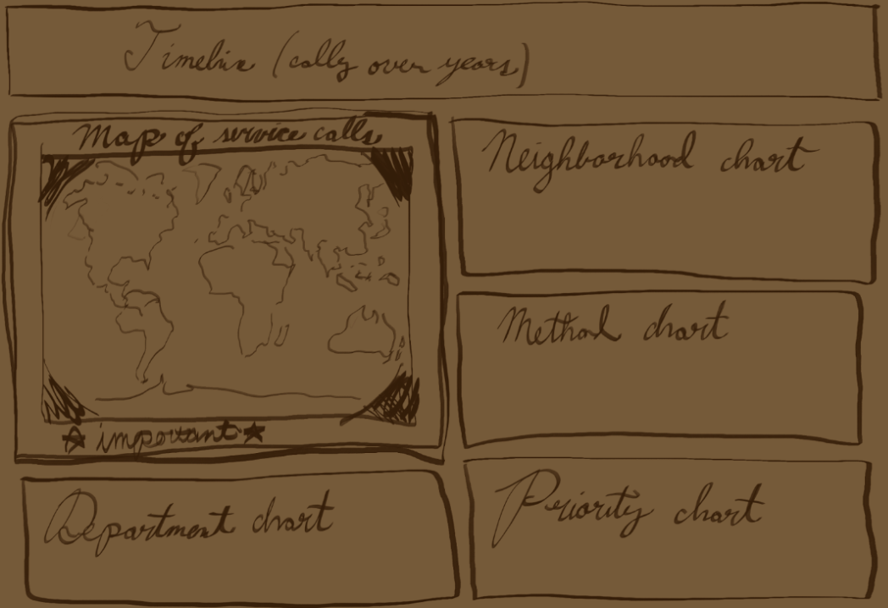
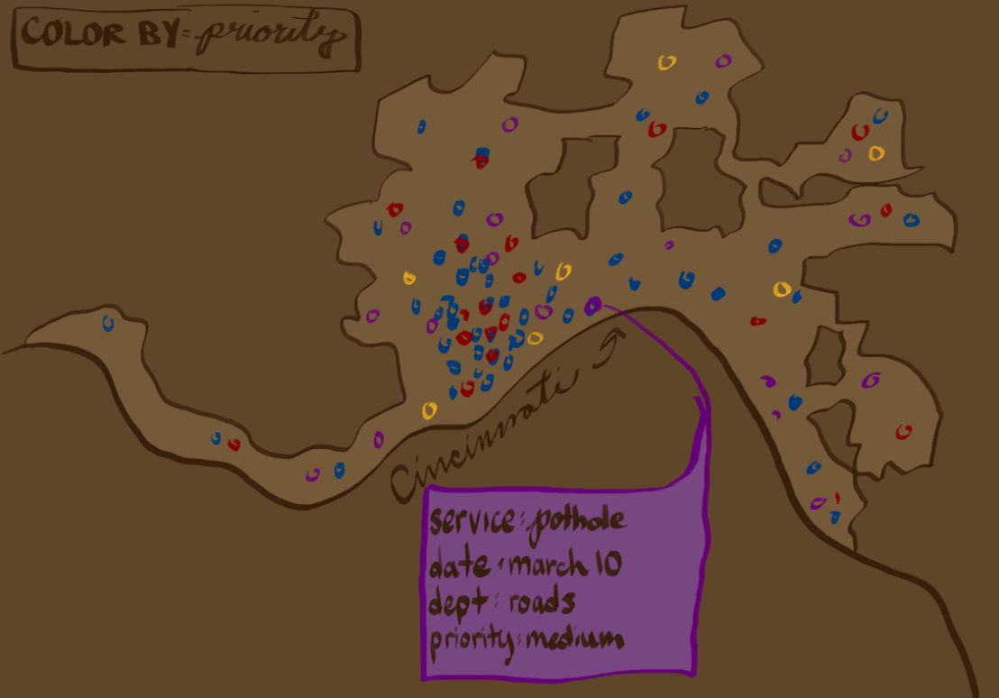
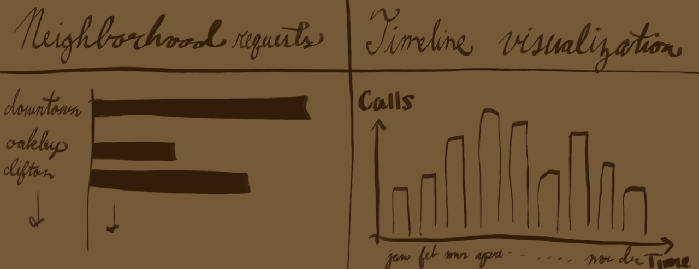
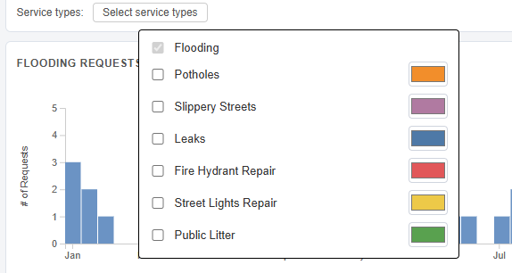
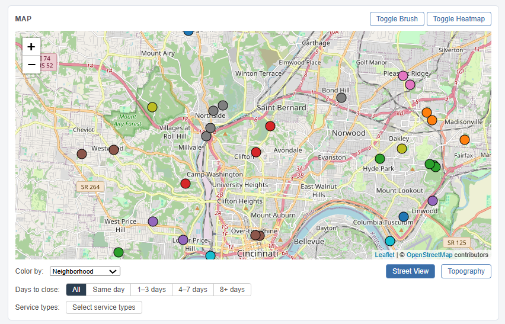

# 311Cincy
An interactive data visualization exploring Cincinnati's 311 non-emergency service requests. Developed by Faith, Fareena, Kelly, and Ikran to help residents and researchers understand how, where, and when city services are being requested.

Live link: https://ikranw.github.io/311Cincy/
Demo: https://drive.google.com/file/d/1sW3t3P8fT2e2toP0J8C2U1IU8Wep2ubl/view?usp=sharing

---

## Motivation

Our application gives a holistic view of 311 requesets in Cincinnati. The primary type of request we focused on was Flooding, however the full list offered is: Flooding, Potholes, Slippery Streets, Leaks, Fire Hydrant Repair, Street Lights Repair, and Public Litter. By utilizing the map and timeline views, supported by the categorical views, a viewer can draw conclusions on when, the method of, where, and how many requests are being made in Cincinnati.

---

## Data

The data we used is a subset of the data Cincinnati's 311 non-emergency service requests. Information about the data, including the full dataset, can be found [here](https://data.cincinnati-oh.gov/efficient-service-delivery/Cincinnati-311-Non-Emergency-Service-Requests/gcej-gmiw/about_data). Our group used specifically the data from 2025. Since the dataset is so large, we first preprocessed it using Pandas to create a seperate dataset with only the entities that we would be focusing on for our project.

---

## Sketches

Before writing any code, we sketched out what we wanted the dashboard to look like. Our main goal was to keep the map and the supporting charts on screen at the same time since they were all linked interactions, so a two-column layout made the most sense for the time we had. The left side holds the map and timeline, and the right side has five smaller charts.

**Overall dashboard layout:**

This was our first sketch and it stayed pretty close to what we actually built. We knew the proportions would shift once we had real data in it.

**Map view:**

The map was the first thing we designed around since it drives most of the geographic context. We knew we wanted some way to show density across the city, which led to the heatmap toggle. Individual points let you see specific requests, while the heatmap gives a better sense of where flooding clusters.

**Timeline:**

We debated between a line chart and a bar chart for the timeline. Since we were grouping requests by week, bars felt more honest since each bar represents a discrete count for that week. We realized how useful the date brush filter was in order to select a time range and have the map update to only show requests from that period.

---

## Visualization Components

<!-- write here -- 1 section on the visualization components: Explain each view of the data, the GUI, etc.  Explain how you can interact with your application, and how the views update in response to these interactions.  Please include screenshots to illustrate, and relate these screenshots to the text.1 section on what your application enables you to discover: Present some findings you arrive at with your application, including screenshots. -->
**Overview of our website:**
Our website started with a focus on flooding requests. There is hover tooltips showcasing information for all visuals. 

**Map**
Our map had a couple features. It had the option for user to choose and color between neighborhood, priority, public agency, and days to complete. It also had a feature where users could choose between 1 or more different service types to filter map and other charts by. And through a web color picker, they can choose the service types data points' colors. The user also has an extra level 8 feature to use: to choose number of days to close to filter the data on the map. There is also differnent map views the user can choose, like heatmap, streetview, and topography. And there is the brush toggle to filter data points on visuals on the website. 

**Timeline**
The timeline chart shows all data requests overtime. It has a feature where user can choose which months to show. It has also a brush action that is activated through the enable date filter. A bar chart was best chosen to demonstrate the changes over time. 

**Neighborhoods**
A horizontal bar chart was selected for this visual to allow easy comparison between neighborhoods and the numbers of requests made. It has a linking action where the user can click on a data point, and all visuals update. 

**Most Common Method**
A piechart was selected because the choices in methods weren't many, so a piechart was a fitting and unique visual to have. We also wanted a variety of types of charts instead of all bar charts. It can be linked through clicking on the slices or the label. And there is a horizontal scroll to easily navigate the labels and data. 

**Service Department**
A lollipop chart was selected as an option to showcase a unique visual not often used. It can is also linked through clicking on the dots of the line, updating all visuals. 

**Priority Chart**
A horizontal bar chart was selected for this data. Since there are only few choices to compare, it makes it easier for the user to draw conclusion through this bar chart without being overwhelmed by information. It is also linked through the clicking on bars. 

**Service Chart**
A horizontal bar chart was selected for this data as well. It was selected for people to have an easy time to compare and contrast between different types fo request. It is also linked through the bar as well. 

---

## What You Can Discover

<!-- write here 1 section on what your application enables you to discover: Present some findings you arrive at with your application, including screenshots.-->
Since our application was mainly focused on flooding data, findings and conclusions connected to flooding will be drawn. One finding was that

---

## Process

We used D3.js (v6) for all the charts (timeline, bar charts, pie chart). The map is built with Leaflet, and we used the leaflet-heat plugin for the heatmap layer. Everything else is plain HTML, CSS, and JavaScript with no framework.

The code is split into separate JS files by component: `leafletMap.js` handles the map, `timeline.js` handles the time chart, and files like `neighborhood.js`, `serviceType.js`, `method.js`, etc. each handle their own chart. `main.js` loads the data and ties everything together.

To run it locally: 
- Clone the repo and run `python3 -m http.server 8000` in the project folder
- Open `localhost:8000` in your browser.

---

## Challenges and Future Work

One of the hardest parts was probably getting all the views to update together when you change a filter. D3 data joins were tricky to get right, especially making sure old elements got removed cleanly instead of stacking on top of each other. The timeline brush interaction also took a while to wire up so that selecting a date range actually filtered the map and other charts correctly.

We also ran into some issues with the filtering pipeline. At one point, layering multiple filters together broke the dataset state and had to roll back locally and start that part over from scratch. It was a good lesson in being careful about how filtered data gets passed between components. We also had to make sure the service type filter propagated to all the charts, not just the map, which took some extra debugging to get right.

Merge conflicts was another concern since the four of us were working on overlapping parts of the codebase at different times. But we communicated our progress regularly so we ran into less conflicts when pushing changes.

If we had more time we would add a time-range slider so you could scrub through dates more smoothly, and show average response time by neighborhood. We might also look into more innovative ways to display all this data. A mobile friendly layout would also help since the dashboard is pretty packed right now.

---

## AI and Collaboration

We used AI minimally as a way to debug our code, and to help us jumpstart features we had never tried to make before. We did not collaborate with any of our peers, however we did discuss during and after class with some others about our progress, and what decisions we made. Particularly, the street view map visual was not working originally for multiple groups, and there was disucssion between students on how to get around the issue.

---

## Who Did What

We took a structured approach on breaking up the workload. We did not want to have too many merge conflicts, so we set up the project in a modular format, where the containers for each visualization were set up first, and then each person was assigned specific ones that they could work on in seperate files. This minimized doing the same work twice, and rarely introduced conflicts. The breakdown of tasks is as follows, however there was additional overlap as people fixed bugs across responsibilities:
- Kelly: everything map related, initial project set up
- Fareena: everything timeline related, brushing and filtering
- Faith: Categorical views (priority and service type charts), concept sketches
- Ikran: Categorical views (neighborhood, method, and department charts), linking interactions and toggles, hosting of site

---

## Demo Video

<!-- write here -->
